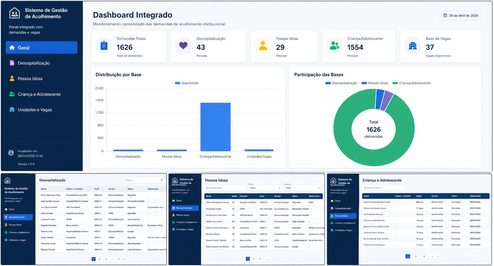

# 🏥 Sistema de Gestão de Acolhimento

Sistema web full stack desenvolvido para gerenciamento de demandas de acolhimento institucional, com integração de planilhas e visualização de dados em tempo real.

O sistema simula um ambiente real de gestão social, permitindo centralizar informações de diferentes fontes e transformá-las em indicadores visuais para tomada de decisão.

---

## 🚀 Tecnologias

- **Frontend:** React + Vite
- **Backend:** Node.js + Express
- **Linguagem:** JavaScript
- **Integração:** CSV (Google Sheets)

---

## 📊 Funcionalidades

- Leitura automática de planilhas CSV (Google Sheets)
- Dashboard com indicadores em tempo real
- Visualização de dados por categoria
- Filtros e organização de dados
- Gestão de atendimentos:

  - Desospitalização  
  - Pessoa Idosa  
  - Criança e Adolescente  
  - Unidades e Vagas  

- Integração completa entre frontend e backend (API REST)

---

## 🧩 Arquitetura

O sistema segue uma arquitetura simples cliente-servidor:

- O **backend** realiza a leitura e tratamento das planilhas CSV
- Os dados são expostos através de endpoints REST
- O **frontend** consome a API e renderiza os dados em tabelas e gráficos

---

## 📸 Preview



---

## ▶️ Como rodar o projeto

### 🔧 Backend

```bash
cd backend
npm install
npm run dev
